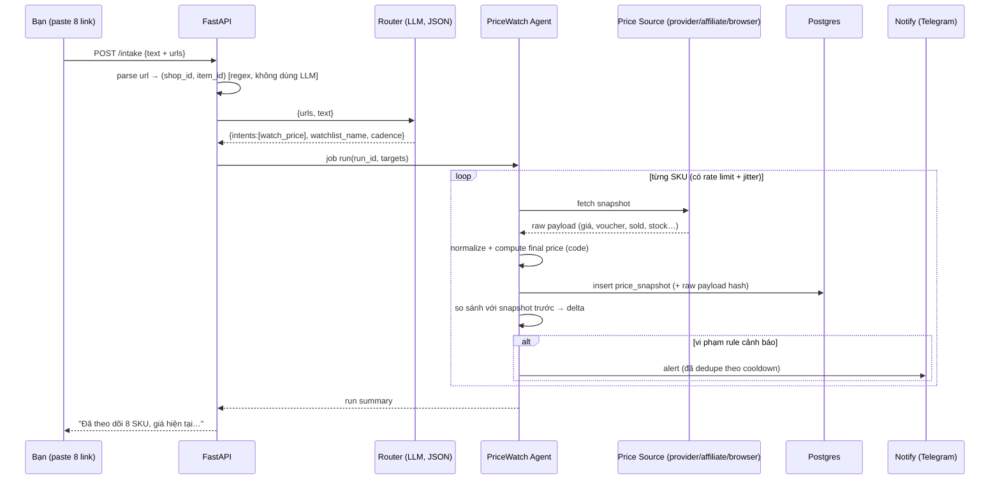

# Agent-Shopee — Kế hoạch hệ thống

> Hệ thống 2 AI agent: **Competitor Price Agent** + **Daily Sales Agent**, điều phối bởi 1 supervisor.
> Đầu vào: dán link Shopee (hoặc text tự do) → agent tự chia việc, chạy, lưu, cảnh báo, báo cáo.
> Ngày lập kế hoạch: 2026-09-29 · Thư mục dự án: `D:/Agent-Shopee`

---

## 0. TL;DR (đọc 60 giây)

| # | Kết luận | Bằng chứng |
|---|---|---|
| 1 | **Truy cập ẩn danh vào Shopee đã chết.** HTTP thô trả shell rỗng (163 KB, 0 field dữ liệu); headless Chromium bị đá sang `/verify/traffic/error?is_logged_in=false` ("Login Required"); `/api/v4/pdp/get_pc` trả `{"error":90309999}`. Block là **token-based (JS-signed)**, không phải IP-based ⇒ proxy/UA rotate không giải quyết. | Probe trực tiếp từ máy này, 2026-09-29 (§12) |
| 2 | **Không tồn tại API chính thức nào trả dữ liệu đối thủ** (giá, tồn, sold, voucher, flash sale). Đã rà toàn bộ **32 module / 465 endpoint** của Shopee Open Platform. Khác biệt thị trường duy nhất: **Affiliate Open API `productOfferV2`** — trả `priceMin/priceMax`, `sales`, `ratingStar` cho **bất kỳ** itemId/shopId, nhưng phải được whitelist. | §2.3 |
| 3 | **Dữ liệu shop của bạn thì lấy được chính thức**: app "Seller In-house System" tự đăng ký (~3 ngày duyệt + 1 ngày Go-live) → Revenue/Orders/AOV (Order API), CVR/impressions/clicks/CTR (Business Insights API), spend/ROAS/GMV (Ads API). **"Visitors" thật chỉ có qua Brand Portal** (không self-serve) ⇒ dùng proxy `product_clicks` + nhãn "ước tính". | §2.2 |
| 4 | **Giá cuối (final price) có voucher ngăn xếp** chỉ lấy được qua nguồn có phiên đăng nhập: provider thương mại (Apify Zen Studio: có `voucherInfo`, `platformVoucher`, `isOnFlashSale`, tồn theo variant, ~**$3.99/1.000 sản phẩm**) hoặc Chromium chạy profile có session thật. | §2.5, §3.3 |
| 5 | **LLM không tính toán.** Mọi con số (giá cuối, KPI, delta, %) do code Python tính; LLM chỉ: phân loại ý định khi paste, gợi ý map SKU đối thủ↔shop mình, viết narrative/anomaly tiếng Việt. | §6 |

**Kiến trúc chốt:** LangGraph supervisor → 2 worker agent (PriceWatch, SalesReport) → toolbox connectors (provider API / Open Platform API / Playwright session) → Postgres → dashboard Next.js + cảnh báo Telegram. Chi tiết §4–§9.

---

## 1. Mục tiêu & phạm vi

### 1.1 Sản phẩm cuối
Một hệ thống chạy local (Docker Compose) + dashboard web, cho phép:

1. **Dán link** (1 hoặc nhiều link Shopee, kèm text kiểu "theo dõi shop này", "báo cáo hôm qua") vào ô chat của dashboard hoặc bot Telegram.
2. Supervisor phân loại → **PriceWatch Agent** và/hoặc **SalesReport Agent** chạy đúng việc.
3. Kết quả: bảng so sánh giá SKU-by-SKU có lịch sử, cảnh báo khi mất giá cạnh tranh, và báo cáo doanh thu hằng ngày có phân tích.

### 1.2 Agent 1 — Competitor Price Agent
| Năng lực | Chi tiết |
|---|---|
| Scan giá | giá niêm yết, giá promo (flash sale/campaign), voucher shop, voucher platform, **final price**, tồn kho, sold count, rating |
| So sánh | SKU-by-SKU với sản phẩm tương ứng của shop bạn (mapping có xác nhận), và so sánh chéo giữa các đối thủ |
| Lịch sử | snapshot theo thời gian → biểu đồ diễn biến giá, phát hiện thời điểm đổi giá/voucher |
| Cảnh báo | mất giá cạnh tranh (bị undercut), đối thủ hết hàng, campaign/flash sale mới, đổi voucher |
| Campaign | nhận diện campaign tag (Flash Sale, Mega Sale, bundle, add-on), thời điểm bắt đầu/kết thúc nếu nguồn trả về |

### 1.3 Agent 2 — Daily Sales Agent
| Metric | Nguồn chính thức | Công thức / ghi chú |
|---|---|---|
| Revenue | `order.get_order_list` + `order.get_order_detail` | Tách **GMV** (trước giảm giá) và **Net Sales** (sau voucher seller). Mặc định báo cáo cả hai |
| Orders | như trên | đếm `order_sn` distinct, loại `CANCELLED`/`IN_CANCEL` theo cấu hình |
| AOV | tính | `Net Sales / Orders` |
| CVR | `business_insights.get_marketing_hot_listing` | `conversion_rate` (shop + product level, có `%_diff` so kỳ trước, có time series) |
| Traffic | `business_insights` | `product_impression`, `product_clicks`, `click_through_rate`. **Nhãn PROXY cho "visitors"** (không có endpoint visitors cho seller thường) |
| ROAS | `ads.get_all_cpc_ads_daily_performance` | `direct_roas`, `broad_roas`, kèm `expense`, `direct_gmv`, `broad_gmv`, `direct_conversions`, `ctr`, `cost_per_conversion` |
| Bổ sung | `payment.get_income_overview` | đối soát tiền về (escrow/payout) |

Ngoài ra agent tự sinh **narrative** (nhận định, anomaly, gợi ý hành động) từ số liệu đã tính — không bịa số.

### 1.4 Ngoài phạm vi (chốt rõ để không phình)
Buybox monitoring nhiều seller cùng SKU, quản lý quảng cáo (tối ưu bid tự động), auto-reply chat, quản lý đơn/tồn kho, dự báo doanh thu ML. (Có thể thành agent thứ 3 ở P4.)

---

## 2. Sự thật dữ liệu (đã kiểm chứng)

### 2.1 Truy cập công khai (anonymous) — bị chặn hoàn toàn
- `curl` HTML: HTTP 200, 163.643 bytes, **0** `__NEXT_DATA__`, **0** `ld+json`, **0** chuỗi `"price"` → chỉ là JS shell + polyfill.
- `/api/v4/pdp/get_pc?item_id=…&shop_id=…` → `{"is_login":false,"error":90309999,"redirect_to_error_page":true}`.
- Chromium headless thật (Playwright/CDP) render trang → redirect `https://shopee.sg/verify/traffic/error?...&is_logged_in=false`, nội dung: *"Login Required — Looks like you're not logged in yet."*
- Nguồn ngoài xác nhận rollout **~giữa/cuối 09-2026, toàn bộ 9 thị trường**: "Shopee moved price, rating and sold count behind a login… a logged-out visitor – human or scraper – no longer receives them on any public Shopee surface"; "the block is token-based, not IP-based. No proxy fixes this."

### 2.2 Shopee Open Platform (chính thức, có gì cho shop của bạn)
| API | Trả về | Ghi chú |
|---|---|---|
| `POST /api/v2/order/get_order_list` + `get_order_detail` | order list, `total_amount`, `create_time`, `pay_time`, `order_status`, `item_list` | cửa sổ tối đa **15 ngày/lần gọi**, `page_size` 1–100, `order_sn_list` tối đa 50 |
| `GET /api/v2/business_insights/get_marketing_hot_listing` | shop-level & product-level: `sales, buyers, orders, units, conversion_rate, product_impression, product_clicks, click_through_rate` + `*_pct_diff` + `time_series` | App type **Seller In-house System / ERP / Product Management**; period `real_time/yesterday/past7days/past30days/monthday/week` |
| `GET /api/v2/ads.get_all_cpc_ads_daily_performance` | `expense, direct_roas, broad_roas, direct_gmv, broad_gmv, direct_conversions, ctr, cost_per_conversion` | app type **Seller In-house System** có Ads API (ERP thì **không**) |
| `GET /api/v2/payment/get_income_overview` | escrow/payout | đối soát |
| `GET /api/v2/product.get_item_base_info` / `get_item_promotion` | `current_price` (đã gồm promo đang chạy), `original_price`, `promotion_type` (Campaign/Discount/Flash Sale…), `promotion_price`, start/end time | phục vụ so sánh SKU của chính mình |
| `GET /api/v2/principal.get_shop_sales_performance_detail` | `unique_visitors`, `product_views`, `item_conversion_rate`, `average_basket_size`, `flash_sale_*`, `voucher_cost` | **chỉ Brand Portal Service** — seller thường không self-serve được |

**KHÔNG có** (đã rà 465 endpoint): dữ liệu đối thủ; voucher/campaign do Shopee chạy; metric `sessions`; traffic-source attribution; visitors cho seller thường; real-time traffic; organic ROAS; sandbox cho Ads/BusinessInsights (phải validate trên production); webhook về metric (phải pull theo lịch).

**Auth:** `partner_id` + `timestamp` (≤5 phút) + `sign = HMAC-SHA256(base_string, partner_key)`; Shop API thêm `access_token` + `shop_id`. OAuth: `GET https://open.shopee.com/auth?partner_id=…&auth_type=seller&redirect_uri=…` → `code` (dùng 1 lần, hết hạn 10 phút) → `POST /api/v2/auth/token/get` → `access_token` (4 giờ), `refresh_token` (30 ngày, **single-use**). Uỷ quyền tối đa 365 ngày. Rate limit có enforce nhưng **không công bố số** (`error_limit` reset 00:00 UTC+8; `error_rate_limit` short-window) ⇒ phải có backoff + budget tracker.

**Onboarding SG (self-serve):** đăng ký open.shopee.com → chọn *Individual Seller* / *Registered Business Seller* → duyệt **3 ngày làm việc** → tạo app (*chỉ được tạo "Seller In-house System"*) → **1 ngày** review → có Live Partner ID/Key. Điều kiện SG: **Mall/Managed seller HOẶC ≥30 đơn trong 30 ngày gần nhất**.

### 2.3 Affiliate Open API (khác biệt duy nhất cho dữ liệu SKU ngoài shop mình)
- `POST https://open-api.affiliate.shopee.sg/graphql`, JSON body `{"query": "...", "variables": {...}}`. **Endpoint sống, đã gọi thử từ máy này**: thiếu header → `{"errors":[{"message":"error [10020]: Invalid Authorization Header"}]}` (HTTP 200).
- Query chính: **`productOfferV2`** (params `shopId`, `itemId`, `keyword`, `sortType`, `page`, `limit`) → nodes:
  `productName`, `itemId`, `shopId`, `shopName`, `shopType`, **`priceMin`/`priceMax`**, `priceDiscountRate`, **`sales`** (sold count), **`ratingStar`**, `imageUrl`, `productLink`, `productCatIds`, `commissionRate/commission`, `periodStartTime/EndTime`.
- Rate limit công bố: **8.000 calls/giờ**. Schema công khai: `https://open-api.affiliate.shopee.sg/explorer/v2`.
- Điều kiện: là **affiliate đã đăng ký** + **được whitelist quyền Open API** (không có SLA công bố; phải liên hệ Shopee). Không có phí công bố.
- Hạn chế: **không tài liệu nào đảm bảo** `priceMin/Max` đã phản ánh flash sale/voucher ⇒ **không được dùng làm final price**; dùng làm giá tham chiếu + sold count + rating, tần suất cao, miễn phí.

### 2.4 Seller Centre (nguồn thủ công dự phòng)
- **Voucher performance**: có nút **Export Excel** theo kỳ (Sales, Orders, Usage rate, Buyers, Claims, Cost).
- **Ads**: có **Export Data**, giới hạn truy xuất **90 ngày** gần nhất (Impressions, CTR, CVR, ROI/ROAS).
- Business Insights dashboard: **chưa tìm thấy tài liệu công khai về export** trên SG (UNVERIFIED) ⇒ coi là không có; nếu cần, dùng Playwright session hoặc chụp thủ công.

### 2.5 Ma trận lựa chọn nguồn cho Competitor Price

| Phương án | Dữ liệu | Chi phí | Rủi ro | Kết luận |
|---|---|---|---|---|
| **P1. Provider thương mại (Apify Zen Studio Shopee Product Detail)** | 186 field: price, promoPrice, strikethrough, flash-sale offer, **voucher**, tồn theo variant, sold, rating, seller metrics (tên field chi tiết phải xác minh ở P0) | **$7.99/1.000** (event `result`, tier FREE); $5.99/1k ở gói GOLD+; trang store ghi "from $3.99/1,000" — **phải đối chiếu ở P0** | thấp (nhà cung cấp gánh anti-bot); phụ thuộc bên thứ ba | ✅ **Primary** |
| **P2. Chromium + session đăng nhập của bạn** | đầy đủ (đúng bằng trình duyệt) | $0 + công bảo trì | **cao**: ToS Shopee cấm "robot, spider… automatic device… to monitor or copy our Content"; điều khoản 5.3 cho phép Shopee **chấm dứt tài khoản tuỳ ý**; cookie TTL 24–48h, token ký theo request vài phút | ⚠️ Chỉ dùng **tài khoản buyer phụ**, throttle thấp, **không** dùng tài khoản seller |
| **P3. Affiliate Open API** | priceMin/Max, discount rate, sold, rating, category | $0 | cần whitelist; không có voucher/flash-sale price | ✅ Bổ trợ (quét diện rộng, tần suất cao) |
| **P4. Provider khác (xtracto $5/1k, gio21 $5/1k, Lumintu, Bright Data)** | ít field hơn (xtracto: detail bị giới hạn sau đổi nền tảng) | $5/1k | như P1 | 🔁 Fallback của P1 |
| **P5. Mobile-app interception (Frida)** | giống app | $0 + dev kit | rất cao, dễ vi phạm ToS, cần emulator farm | ❌ Không làm |

> **Quyết định mặc định:** P1 + P3 (provider là primary; affiliate là lớp quét rộng), P2 chỉ bật cho SKU trọng yếu nếu bạn chấp nhận rủi ro bằng tài khoản buyer phụ. Kiến trúc là **pluggable** nên đổi nguồn = đổi config, không sửa agent.

#### 2.5.1 Shortlist provider — số liệu live qua Apify API (đo 2026-09-29)

| Actor | Run thành công 30 ngày | Users 30d | Giá | Field dùng được cho final price | Kết luận |
|---|---|---|---|---|---|
| `zen-studio/shopee-product-detail-scraper` | **96.0%** (8.209/8.552) | 168 | $7.99/1k (result, FREE); $5.99/1k GOLD+ | ✅ 186 field, có voucher + flash sale + tồn theo variant (theo README actor) | ✅ **Primary** |
| `zen-studio/shopee-product-scraper` (search) | 96.5% (6.276/6.503) | 281 | $7.99/1k + $3.99/1k enrichment | ⚠️ chủ yếu dữ liệu listing | Dùng để **discovery** (tìm SKU mới của đối thủ) |
| `gio21/shopee-scraper` | **99.4%** (5.536/5.570) | 243 | **$1/1k** | ❌ không voucher/flash-sale; tài khoản Apify free không lấy được dữ liệu live | ✅ Fallback rẻ cho "giá + sold + rating" |
| `xtracto/shopee-scraper` | 97.8% (3.210/3.281) | 160 | $20/1k ($15/1k GOLD+) | ⚠️ detail bị giới hạn sau khi Shopee đổi nền tảng | 🔁 Fallback |
| `webdata_labs/shopee-scraper` | 91.8% (760/828) | 32 | $5/1k | ⚠️ chưa xác minh field voucher | 🔁 Fallback |
| `kazkn/shopee-product-scraper-no-login` (repo `DataKazKN/shopee-product-scraper-examples`) | **38.4%** (33/86, **53 FAILED**) + cờ **UNDER_MAINTENANCE** | 35 | $4.80/1k | ❌ chỉ price/currency/seller/rating/availability/IDs/URL — **không voucher, không flash sale, không sold, không tồn theo variant** | ❌ **Loại** |

**Về repo `DataKazKN/shopee-product-scraper-examples` (bạn gửi):** đây **không phải scraper**, mà là bộ ví dụ Python/JS/cURL/n8n gọi một actor Apify của người khác, có ghi rõ *"This is an affiliate link; I may earn a commission"*. Repo: tạo 2026-08-26, 4 commit, commit cuối 2026-09-05 (trước/sát thời điểm Shopee dựng tường login), 0 sao, 0 issue. Giá trị duy nhất đáng bê vào hệ thống là **kỷ luật so sánh snapshot** trong `python/compare_snapshots.py`:
- khoá định danh `(market, shop_id, product_id)`, giữ ID dạng chuỗi (không đi qua float);
- **từ chối** so sánh nếu 2 snapshot khác currency (không tự quy đổi);
- `missing` ≠ hết hàng (không suy diễn tồn kho từ việc thiếu dòng);
- output chỉ ghi file mới (exclusive create), không ghi đè input.
⇒ Ba ngữ nghĩa này sẽ được đưa vào `tools/compare.py` của dự án (xem §4.1 diff engine) — phần còn lại của repo không dùng được vì thiếu voucher/flash-sale và tỷ lệ run quá thấp.

#### 2.5.2 Kết quả P0 — chạy thật actor Zen Studio trên đúng 8 link (2026-09-29)

**Kết quả: 8/8 SKU thành công** (run `dRhUK0iRms6XJSFAJ` cho SKU đầu, run 7 link còn lại trong 42,9s ≈ 6s/SKU). Raw payload: `fixtures/raw/zen_studio_2026-09-29.json` (186 field/SKU). Shop 34229630 = **"Ultimate Sup"** (SG).

| itemId | giá (min–max) | promoPrice | cardDisplayPrice | tính lại từ breakdown | khớp | flash | voucher shop | voucher platform | stock | variants |
|---|---|---|---|---|---|---|---|---|---|---|
| 2591950137 | 75–321 | 161 | 144,20 | 161 − 4,8 − 12 = 144,2 | ✓ | Y | ULTID151 −4,8 (min 151) | 2026BATCH212OFF −12 | 1.897 | 56 |
| 21924706357 | 83,3–237 | 198,95 | 182,15 | 198,95 − 4,8 − 12 = 182,15 | ✓ | – | ULTID151 −4,8 (min 151) | −12 | 3.595 | 24 |
| 22743205937 | 93,45–244,25 | 201,25 | 182,25 | 201,25 − 7 − 12 = 182,25 | ✓ | – | ULTID199 −7 (min 199) | −12 | 3.787 | 25 |
| 5148755036 | 85–170 | 85 | 73,00 | 85 − 12 = 73 | ✓ | Y | – | −12 | 919 | 13 |
| 19623941284 | 21,78–62,15 | 27,5 | 15,50 | 27,5 − 12 = 15,5 | ✓ | – | – | −12 | 1.149 | 13 |
| 6487935366 | 109,03–231,88 | 109,03 | 92,03 | 109,03 − 5 − 12 = 92,03 | ✓ | Y | ULTI5BSN −5 (min 99) | −12 | 95 | 22 |
| 9037970487 | 30,03–45 | 30,03 | 18,03 | 30,03 − 12 = 18,03 | ✓ | – | – | −12 | 166 | 9 |
| 2889378598 | 95,78–277,94 | 255 | 236,00 | 255 − 7 − 12 = 236 | ✓ | – | ULTID199 −7 (min 199) | −12 | 921 | 29 |

**Xác nhận được (đủ để chốt provider chính là nguồn `final_price`):**
1. **Waterfall giá đúng 8/8**: `cardDisplayPrice = promoPrice − shopVoucher (nếu promoPrice ≥ minSpend) − platformVoucher`. Đây chính là mô hình §3.3 — kiểm chứng bằng số thật, không phải suy đoán.
2. Field voucher có cấu trúc dùng được: `{promotionId, voucherCode, voucherDiscount, minSpend, timeInfo{startTime,endTime}}` cho cả `shopVoucher` và `platformVoucher`; `hasVoucher`, `adsVoucher`, `cardPromotion.discount`.
3. Campaign: `isOnFlashSale` (3/8 = true), `upcomingFlashSale`, `cardPromotion`, `bundleDeal`, `addOnDeal`.
4. **SKU-by-SKU thật**: `models[]` = 191 variant cho 8 SKU, mỗi variant có `modelId, name, price, stock` riêng → so sánh ở cấp variant, không chỉ cấp listing.
5. Tồn kho: `stock` (8/8) + `stock` theo variant; `rating`, `ratingCount`, `likedCount`, `commentCount`, `shopRating/ResponseRate/CancellationRate/FollowerCount`.
6. `strikethroughPrice`, `priceBeforeDiscount*`, `discountPercent`, `cardDisplayPrice` đủ để dựng "đã giảm bao nhiêu".

**Khoảng trống phát hiện được (phải xử lý trong P1):**
- **`sold` / `historicalSold` / `soldDisplayed` / `soldMonthly` = null trên cả 8 SKU** ⇒ **không có sold count từ provider này**. Velocity bán của đối thủ phải lấy từ (a) Affiliate `productOfferV2.sales`, hoặc (b) delta `ratingCount`/ngày làm proxy, hoặc (c) provider phụ (gio21 có `historicalSoldEstimated` dạng bucket). Rule `competitor_sales_spike` phải cấu hình theo nguồn có thật.
- `enriched: false`, `collectedVia: null` — metadata không dùng được làm provenance ⇒ tự ghi `source=provider`, `provider_run_id`, `scrapedAt` khi lưu snapshot.
- Giao field giữa các market khác nhau (VD VN không có giá/tồn theo variant) ⇒ normalizer phải chịu được `null` và gắn `final_price_confidence`.

**Chi phí thật của lần test:** 2 run = **$0,024** (account `monthlyUsageUsd`). Cấu hình giá ghi trong run: event `result` = **$0,00499/sp** + `reviews` $0,00399 + dataset item $0,00001 + actor start $0,008 — nhưng `chargedEventCounts.result = 0` trên cả 2 run (chưa bị tính tiền). ⇒ Ngân sách vẫn phải tính theo giá niêm yết ($4,99–7,99/1k, tùy thời điểm cấu hình giá của actor), **không** xây trên giả định miễn phí. Lưu ý actor đổi giá/build liên tục (modified 2026-09-29): luôn đọc `pricingInfo` của run để tính tiền.

---

## 3. Kiến trúc tổng thể

```mermaid
flowchart TB
  subgraph IN["Đầu vào"]
    UI["Dashboard: ô dán link + chat"]
    TG["Telegram bot"]
    CRON["Scheduler (Celery beat / APScheduler)"]
  end

  subgraph ORCH["Orchestrator (LangGraph supervisor)"]
    R["Router node<br/>LLM classify intent (JSON schema)"]
    PW["PriceWatch Agent"]
    SR["SalesReport Agent"]
  end

  subgraph TOOLS["Toolbox (typed Python tools)"]
    C1["price_source: provider API"]
    C2["price_source: affiliate GraphQL"]
    C3["price_source: browser session (Playwright)"]
    C4["seller_api: Open Platform (orders/BI/ads)"]
    C5["import: CSV/Excel Seller Centre"]
  end

  subgraph DATA["Lưu trữ"]
    PG[("Postgres")]
    RD[("Redis (queue/cache)"]
    FS["Object store (raw payload, fixtures"]
  end

  subgraph OUT["Đầu ra"]
    DASH["Dashboard: bảng so sánh, chart, report"]
    ALERT["Telegram / Email alert"]
    REP["Daily report (Markdown/PDF)"]
  end

  UI --> R
  TG --> R
  CRON --> PW
  CRON --> SR
  R --> PW
  R --> SR
  PW --> C1 & C2 & C3
  SR --> C4 & C5
  PW --> PG
  SR --> PG
  PG --> DASH & ALERT & REP
```

### 3.1 Luồng khi bạn dán link



### 3.2 Nguyên tắc thiết kế
1. **Deterministic trước, LLM sau.** Parse link/ID, tính giá, tính KPI, so sánh, áp rule = code có test. LLM chỉ ở 3 điểm: classify intent, gợi ý SKU mapping, viết narrative.
2. **Raw-first.** Luôn lưu payload gốc (object store) + hash; mọi field chuẩn hoá đều có `source`, `confidence`, `captured_at`. Khi provider đổi schema, replay raw để backfill.
3. **Nguồn dữ liệu là plugin.** `PriceSource` protocol (`fetch(item) -> ProductSnapshot`) với các impl: `ApifyProviderSource`, `AffiliateGraphQLSource`, `BrowserSessionSource`, `ManualCsvSource`. Chọn theo thứ tự ưu tiên + fallback tự động.
4. **Nguồn nào ghi rõ nguồn đó trên UI** (badge: `provider` / `affiliate` / `browser` / `manual`) + độ tin cậy của trường (`final_price: exact | partial | estimated`).
5. **Idempotent & có ledger.** Mỗi lần chạy = 1 `agent_run`; mỗi request = 1 dòng `fetch_log` (giá tiền/thời gian/lỗi). Không bao giờ double-alert (cooldown theo rule+SKU).

### 3.3 Mô hình final price (waterfall — bắt buộc lưu từng tầng)
```
listed_price            giá gốc (strikethrough / original)
  → promo_price         flash sale / campaign price        [source: field isOnFlashSale/promoPrice]
  → − seller_voucher    voucher shop (%, số tiền, min_spend, cap)
  → − platform_voucher  voucher Shopee / coins / mã giảm
  → + shipping_fee      (tuỳ chọn, bật khi so landed cost)
  = final_price
```
Quy tắc:
- Chỉ tính `final_price` khi **các tầng có bằng chứng**; nếu thiếu tầng nào ⇒ `final_price_confidence: partial` và UI hiện dấu `~`.
- Voucher có `min_spend` ⇒ chỉ áp khi `promo_price ≥ min_spend`; voucher có `cap` ⇒ cap số tiền giảm.
- Nhiều voucher loại trừ nhau ⇒ áp tối đa 1 seller + 1 platform (cấu hình được trong `pricing_rules.yaml`).
- Output luôn kèm `breakdown[]` để giải trình, không bao giờ chỉ 1 con số.

---

## 4. Thiết kế chi tiết 2 agent

### 4.1 PriceWatch Agent
**Graph (LangGraph):** `resolve_targets → ensure_mapping → fetch_snapshot → normalize → compute_final_price → persist → diff_prev → evaluate_rules → (alert | quiet) → summarize`

**Input/Output contract (Pydantic):**
```python
class ProductSnapshot(BaseModel):
    shop_id: int; item_id: int; name: str | None
    listed_price: Decimal | None; promo_price: Decimal | None
    seller_voucher: Voucher | None; platform_voucher: Voucher | None
    final_price: Decimal | None; final_price_confidence: Literal["exact","partial","estimated"]
    stock: int | None; sold: int | None; rating: float | None
    campaign: Campaign | None            # flash_sale | mega_sale | bundle | unknown
    source: Literal["provider","affiliate","browser","manual"]
    captured_at: datetime; raw_ref: str  # trỏ tới payload gốc
```
**Diff engine:** so với snapshot gần nhất và với "baseline 7 ngày" → `price_drop_pct`, `voucher_changed`, `campaign_started`, `restocked`, `sold_delta/day` (bán chạy lên/xuống).

**Rule engine (YAML, không code cứng):**
```yaml
- id: undercut_by_competitor
  when: mapping.own_item_id is not null
  expr: competitor.final_price < own.final_price * 0.97
  cooldown: 6h
  channel: [telegram]
- id: competitor_price_drop
  expr: delta.final_price_pct <= -5
  cooldown: 12h
- id: campaign_started
  expr: snapshot.campaign != prev.campaign and snapshot.campaign in ['flash_sale','mega_sale']
- id: out_of_stock
  expr: snapshot.stock == 0 and prev.stock > 0
- id: competitor_sales_spike
  # velocity PHẢI theo nguồn có thật: affiliate `sales` | delta ratingCount/ngày | provider có historicalSold
  requires: sales_signal            # Zen Studio hiện trả sold=null ⇒ rule tự tắt, dùng rating_delta thay thế
  expr: velocity_1d >= 2 * velocity_7d_avg and velocity_1d >= 5
```

**SKU mapping (đối thủ ↔ shop mình):** LLM **gợi ý** (title embedding + variant attributes) → lưu `sku_mapping` với `confidence` → **chờ bạn xác nhận** (1 nút trên dashboard; auto-confirm nếu cùng `item_id` được add tay). Không bao giờ tự ý so sánh cặp chưa xác nhận mà không gắn nhãn "gợi ý".

**Lịch chạy:** mặc định 60 phút/lần trong 08:00–23:00 SGT cho watchlist; 10 phút/lần trong "promo window" (11.11, 12.12, payday 15 & 25, flash sale giờ vàng — cấu hình). Jitter ±90s, rate limit theo nguồn.

### 4.2 SalesReport Agent
**Graph:** `pull_orders → pull_ads → pull_insights → reconcile_payment → compute_kpis → validate → detect_anomalies → narrate(LLM) → deliver → persist_report`

**Chi tiết kỹ thuật nguồn:**
- Orders: gọi `get_order_list` theo cửa sổ ≤15 ngày (mặc định T-1, có `--backfill N ngày`); `order_status` mặc định `[READY_TO_SHIP, PROCESSED, SHIPPED, COMPLETED]`; page qua `next_cursor`.
- Ads: `get_all_cpc_ads_daily_performance` (daily) — lưu `expense, direct_roas, broad_roas, direct_gmv, broad_gmv, conversions, ctr, cost_per_conversion`; GMV Max qua `get_gms_campaign_performance`.
- Insights: `get_marketing_hot_listing` period `yesterday` + `past7days` → `conversion_rate`, `product_impression`, `product_clicks`, `click_through_rate`, `*_pct_diff`, `time_series`.
- **Độ trễ dữ liệu:** Ads/BI cập nhật **sau 09:00–12:00 SGT hôm sau** ⇒ job chạy **07:30 SGT** chỉ dùng dữ liệu T-1 đã chốt; có bước "re-run 13:30" để cập nhật nếu số liệu T-1 đổi (lưu cả hai, cờ `is_final`).
- **PROXY metric:** `visitors_proxy = product_clicks`; UI ghi rõ "Proxy (clicks) — không phải unique visitors". Nếu sau này bạn vào được Brand Portal, hạ tầng tự swap sang `unique_visitors` (thêm key vào `metric_sources.yaml`).

**KPI & công thức (định nghĩa chốt trong `metrics.py`):**
```
GMV            = Σ (item_price_original × qty)
Net_Sales      = Σ (item_price_after_seller_discount × qty)
Orders         = count(distinct order_sn) [trừ cancelled theo config]
AOV            = Net_Sales / Orders
CVR            = Orders / product_clicks          # nhãn proxy
CTR            = product_clicks / product_impression
ROAS_direct    = direct_gmv / expense
ROAS_broad     = broad_gmv / expense
ACOS           = expense / broad_gmv
Refund_rate    = refund_amount / Net_Sales        (khi có)
```
Mọi tỷ lệ kèm `delta_vs_yesterday`, `delta_vs_7d_avg`; timezone **Asia/Singapore**; tiền tệ **SGD**, `Decimal` (không dùng float).

**Narrative (LLM, chỉ đọc số đã tính):** 5–8 câu tiếng Việt: tóm tắt ngày, 3 điểm đáng chú ý nhất, 1–2 bất thường kèm giả thuyết (voucher hết hạn? ads tăng spend? đối thủ phá giá? — cross-reference với PriceWatch nếu có), 3 gợi ý hành động. Prompt có guardrail: *"chỉ dùng số trong JSON; nếu thiếu số, nói thiếu"*.

---

## 5. Orchestration (supervisor)

| Node | Loại | Việc |
|---|---|---|
| `intake_parser` | code | Regex bắt `shopee.<tld>/product/<shop_id>/<item_id>` và `-i.<shop_id>.<item_id>`; short link (`s.shopee.sg`) → resolve qua browser nếu cần |
| `router` | LLM (JSON schema) | Phân loại: `watch_price` / `report_sales` / `compare` / `query` (hỏi lại dữ liệu cũ) / `build_daily_report` / `unknown`. Output: `{intents[], entities{shops,items,date_range}, watchlist_name, cadence}`. Fallback heuristic nếu LLM lỗi: có URL ⇒ `watch_price`; chứa "báo cáo/doanh thu" ⇒ `report_sales` |
| `planner` | code | Sinh job DAG (task, phụ thuộc, ưu tiên), ghi `agent_runs` |
| `workers` | code + tools | PriceWatch / SalesReport như §4 |
| `critic/validator` | code (+ LLM tuỳ chọn) | Kiểm tra: số liệu không null trái phép, tổng đơn khớp payment, giá không âm, đối chiếu chéo 2 nguồn cho SKU có cả provider + affiliate (lệch >3% ⇒ cảnh báo data-quality, không tự ý chọn) |
| `reporter` | LLM | Narrative + format Markdown/PDF |
| `notifier` | code | Telegram/Email, dedupe + cooldown |

**Human-in-the-loop:** xác nhận SKU mapping; phê duyệt watchlist mới > 50 SKU (tránh đốt tiền provider); duyệt trước khi bật nguồn "browser session" cho SKU bất kỳ.

**Idempotency:** khoá job = `(kind, target, window, source)`; retry có backoff luỹ thừa + jitter; lỗi 1 SKU không làm fail cả run (partial success được ghi nhận).

---

## 6. Chính sách LLM

| Việc | LLM? | Model đề xuất | Ghi chú |
|---|---|---|---|
| Parse link/ID | ❌ | — | regex, deterministic |
| Tính giá/KPI/delta | ❌ | — | `Decimal`, có unit test |
| Áp rule cảnh báo | ❌ | — | YAML + engine |
| Classify intent khi paste | ✅ | model rẻ (haiku/flash/mini) | structured output bắt buộc |
| Gợi ý map SKU đối thủ↔mình | ✅ | model rẻ + embedding | có người xác nhận |
| Narrative báo cáo/anomaly | ✅ | model trung (sonnet/4o-class) | 1 call/ngày, prompt caching |
| Trả lời câu hỏi tự do trên dữ liệu | ✅ | text-to-SQL có kiểm soát (chỉ view read-only) | P3 |

Chi phí dự kiến: **< $15/tháng** (1 báo cáo/ngày + vài chục lần classify/narrate). Ghi log token/call vào `llm_calls` để bạn thấy chi phí thật.

---

## 7. Data model (Postgres)

```sql
shops(id, name, shop_type, is_own bool, created_at)
items(id, shop_id, item_id, name, url, category_path, first_seen_at)     -- SKU gốc Shopee
skus(item_id, model_id, variant_name, attrs jsonb)                       -- biến thể nếu nguồn trả
watchlists(id, name, cadence, promo_windows jsonb, created_by)
watchlist_items(watchlist_id, item_id, priority, added_at)
price_snapshots(id, item_id, sku_id null, listed_price, promo_price,
                seller_voucher jsonb, platform_voucher jsonb, final_price,
                final_price_confidence, stock, sold, rating, campaign jsonb,
                source, captured_at, raw_ref)                            -- index (item_id, captured_at)
vouchers(id, item_id, kind, code, discount_type, value, min_spend, cap,
         valid_from, valid_to, source, captured_at)
sku_mapping(id, own_item_id, competitor_item_id, confidence, method,
            confirmed_by, confirmed_at)                                  -- human-in-the-loop
kpi_daily(shop_id, date, gmv, net_sales, orders, aov, cvr, clicks,
          impressions, ctr, visitors_proxy, ad_spend, direct_gmv, broad_gmv,
          roas_direct, roas_broad, acos, refund_amount, is_final, computed_at)
ads_campaign_daily(campaign_id, date, type, expense, gmv, roas, conversions, ctr, cpc)
reports(id, shop_id, date, markdown, pdf_ref, narrative, llm_model, created_at)
alerts(id, rule_id, item_id, severity, payload jsonb, sent_at, cooldown_until)
agent_runs(id, kind, triggered_by, status, started_at, finished_at, cost_usd, error)
fetch_log(id, run_id, source, endpoint, target, status, latency_ms, cost_usd, error_code)
llm_calls(id, run_id, purpose, model, prompt_tokens, completion_tokens, cost_usd)
```

---

## 8. Repository layout & stack

```
D:/Agent-Shopee
├─ docker-compose.yml            # postgres, redis, api, worker, beat, web
├─ pyproject.toml                # uv/poetry, python 3.11
├─ .env.example                  # secrets: PARTNER_ID/KEY, ACCESS_TOKEN store, APIFY_TOKEN, TELEGRAM_*
├─ PLAN.md                       # tài liệu này
├─ config/
│  ├─ pricing_rules.yaml         # waterfall voucher, exclusion rules
│  ├─ alert_rules.yaml
│  ├─ metric_sources.yaml        # nguồn cho từng metric + proxy flags
│  └─ sources.yaml               # thứ tự ưu tiên PriceSource + rate limit
├─ fixtures/
│  └─ shopee_sg_watchlist.yaml   # 8 link test (§10)
├─ src/agent_shopee/
│  ├─ api/            # FastAPI: /intake, /watchlists, /snapshots, /kpis, /reports, /alerts
│  ├─ orchestrator/   # langgraph: supervisor.py, graphs/price_watch.py, graphs/sales_report.py, state.py
│  ├─ tools/
│  │  ├─ price_sources/{base.py,apify_provider.py,affiliate_graphql.py,browser_session.py,manual_csv.py}
│  │  ├─ seller_api/{client.py,orders.py,business_insights.py,ads.py,payment.py,oauth.py}
│  │  ├─ normalize.py       # payload → ProductSnapshot
│  │  ├─ pricing.py         # waterfall final price
│  │  ├─ metrics.py         # KPI + delta
│  │  ├─ rules.py           # alert engine
│  │  └─ notify/telegram.py
│  ├─ db/{models.py,repo.py,alembic/}
│  ├─ jobs/{scheduler.py,tasks.py}
│  └─ llm/{client.py,prompts/*.md,schemas.py}
├─ web/               # Next.js 15 + shadcn/ui + Recharts
│  ├─ app/(dashboard)/watchlist, snapshots, compare, reports, alerts
│  └─ app/intake      # ô dán link + hội thoại
└─ tests/{unit,integration,e2e,fixtures}
```

**Stack:** Python 3.11 · FastAPI · Pydantic v2 · SQLAlchemy 2 + Alembic · Postgres 16 · Redis + Celery (+beat) · LangGraph · httpx · Playwright (Chromium, chỉ cho session/intake) · LiteLLM (đa nhà cung cấp) · python-telegram-bot · Next.js 15 + Tailwind + shadcn/ui + Recharts · pytest + respx + pytest-playwright · Docker Compose · Structured logging (loguru JSON) + `fetch_log`/`llm_calls` để đo chi phí.

---

## 9. Test plan (dùng đúng 8 link bạn đưa)

**Fixture:** tất cả 8 link đều thuộc **shop_id 34229630** (đã parse, xem `fixtures/shopee_sg_watchlist.yaml`):
`2591950137`, `21924706357`, `22743205937`, `5148755036`, `19623941284` (link slug `-i.34229630.…`), `6487935366`, `9037970487`, `2889378598`.

| Tầng test | Nội dung | Tiêu chí đạt |
|---|---|---|
| Unit — parser | 8 link (2 định dạng URL) | trả đúng `(shop_id, item_id)`, 8/8 |
| Unit — pricing | fixture JSON các tổ hợp voucher/campaign | `final_price` + `breakdown` khớp expected (golden test), gồm case `min_spend` không đạt, `cap` chặn, 2 voucher loại trừ |
| Unit — metrics | fixture orders/ads/insights giả | GMV/Net/AOV/CVR/ROAS/ACOS khớp tay tính |
| Contract | schema provider + affiliate + Open Platform | parse không lỗi với payload ghi lại (recorded), lỗi rõ ràng khi thiếu field |
| Integration | chạy thật 8 SKU qua PriceSource đã chọn | 8/8 có snapshot; lưu raw; lần chạy thứ 2 (sau 5 phút) tạo delta đúng — **đã đạt 8/8 ngày 2026-09-29 với Zen Studio, xem §2.5.2** |
| Integration | Open Platform sandbox (Product/Order/Shop) | lấy được order list + item base info; Ads/BI chạy trên production (sandbox không hỗ trợ) |
| E2E | paste 8 link trong dashboard → xem watchlist + bảng so sánh; giả lập rule `undercut` → có alert Telegram | dữ liệu hiện trên UI, alert tới nơi, dedupe/cooldown hoạt động |
| E2E | job 07:30 SGT sinh report | report Markdown + narrative, số khớp DB, không có số `null` |
| Data-quality | SKU có cả provider + affiliate | lệch giá >3% ⇒ sinh cảnh báo data-quality (không tự chọn bừa) |

**Định nghĩa "xong" cho mỗi thay đổi:** unit test + 1 smoke chạy thật trên ≥1 link trong 8 link, có log chứng minh.

---

## 10. Roadmap

| Phase | Thời lượng | Nội dung | Definition of Done |
|---|---|---|---|
| **P0 — Source spike** | 1–2 ngày | Viết `spikes/probe_sources.py` thử 3 nguồn (provider Apify / affiliate GraphQL nếu có quyền / Playwright session) trên 8 link; đo field nhận được, độ trễ, chi phí/lần, tỷ lệ lỗi | Báo cáo so sánh + quyết định nguồn chính thức; chốt được `final_price` lấy từ đâu; fixture raw lưu lại |
| **P0b — Đăng ký API (song song, chờ duyệt)** | 3–5 ngày làm việc | Nộp hồ sơ Open Platform (Seller In-house System app); nếu muốn tầng affiliate: đăng ký affiliate + xin whitelist Open API | Có Partner ID/Key live + access_token/refresh_token lưu an toàn; test gọi được `shop.get_shop_info` |
| **P1 — PriceWatch MVP** | 5–7 ngày | DB + PriceSource plugin + pricing waterfall + snapshot/diff + alert Telegram + dashboard bảng so sánh & lịch sử giá + intake paste link | Paste 8 link → 8 snapshot, chart lịch sử, 1 rule cảnh báo chạy thật |
| **P2 — SalesReport MVP** | 5–7 ngày | OAuth flow + orders/ads/insights pull + `metrics.py` + report 07:30 SGT + narrative + trang Reports | 7 ngày liên tiếp có report khớp số Seller Centre (đối soát thủ công ≥3 ngày) |
| **P3 — Compare & analytics** | 1 tuần | SKU mapping + gợi ý LLM, so sánh chéo đối thủ, cảnh báo undercut, anomaly + cross-reference giá ↔ doanh thu, xuất PDF | Bảng so sánh own vs competitor có xác nhận mapping; cảnh báo phá giá chạy thật |
| **P4 — Mở rộng (tuỳ chọn)** | sau | Agent 3 (Ads optimizer đề xuất), review/rating monitor, dự báo sold velocity, multi-shop/multi-thị trường | — |

**Critical path:** P0 (nguồn giá) quyết định P1; hồ sơ Open Platform nộp ngay từ ngày 1 để không chặn P2.

---

## 11. Rủi ro & giảm thiểu

| # | Rủi ro | Mức | Giảm thiểu |
|---|---|---|---|
| 1 | Shopee tiếp tục siết anti-bot; provider thương mại vỡ | Cao | Thiết kế `PriceSource` plugin + tối thiểu 2 provider cấu hình sẵn; lưu raw để đổi nguồn không mất lịch sử; cảnh báo khi tỷ lệ fetch lỗi >20% |
| 2 | Vi phạm ToS / khoá tài khoản khi tự động hoá bằng session | Cao | **Không** dùng tài khoản seller để scrape; chỉ provider, hoặc tài khoản buyer phụ + throttle + chỉ SKU trọng yếu; ghi rõ rủi ro trong UI trước khi bật |
| 3 | Thiếu `Visitors` thật cho seller thường | Trung bình | Dùng `product_clicks` làm proxy (có nhãn), hoặc import Excel BI/Traffic nếu bạn export tay; đường nâng cấp Brand Portal |
| 4 | Open Platform rate limit không công bố | Trung bình | Backoff, budget tracker theo `error_limit` (reset 00:00 UTC+8), batch ≤50 item, cửa sổ ≤15 ngày |
| 5 | Ads/BusinessInsights không có sandbox | Trung bình | Validate trên production với 1 shop thật, chạy chế độ "dry-run so sánh với export Ads 90 ngày" |
| 6 | Provider đổi schema/field | Trung bình | Contract test + raw replay; version hoá normalizer |
| 7 | Giá `priceMin/Max` của affiliate không phải final price | Trung bình | Chỉ dùng làm tham chiếu; `final_price_confidence` bắt buộc; không trộn 2 nguồn vào cùng 1 con số |
| 8 | Chi phí provider vượt dự toán | Thấp | Budget guard: trần USD/tháng, tần suất giảm khi vượt, quét promo window dày hơn giờ thường |
| 9 | Dữ liệu T-1 chưa chốt khi job chạy | Thấp | Job 07:30 + re-run 13:30, cờ `is_final`, cảnh báo khi số đổi >1% |

---

## 12. Bằng chứng kiểm chứng (2026-09-29, máy này)

```bash
# 1) HTTP thô → JS shell, không dữ liệu
curl -sS -o /tmp/sg1.html -w "status=%{http_code} size=%{size_download}\n" \
  -A "Mozilla/5.0 … Chrome/126.0 Safari/537.36" \
  "https://shopee.sg/product/34229630/2591950137/"
# → status=200 size=163643 ; HTML: __NEXT_DATA__=0, ld+json=0, "price"=0, captcha=2

# 2) API nội bộ → anti-bot
curl "https://shopee.sg/api/v4/pdp/get_pc?item_id=2591950137&shop_id=34229630&detail_level=0"
# → {"is_customized":false,"is_login":false,"action_type":2,"error":90309999,
#    "redirect_to_error_page":true}

# 3) Chromium headless thật → login wall
# browser.open("https://shopee.sg/product/34229630/2591950137/") sau 8s:
#   url   = https://shopee.sg/verify/traffic/error?...&is_logged_in=false&type=4
#   text  = "Login Required … Looks like you're not logged in yet."
#   fetch('/api/v4/pdp/get_pc…') trong trang → {"err":90309999}

# 4) Affiliate Open API sống, chỉ thiếu auth
curl -X POST https://open-api.affiliate.shopee.sg/graphql -H 'Content-Type: application/json' \
  -d '{"query":"query{__typename}"}'
# → 200 {"errors":[{"message":"error [10020]: Invalid Authorization Header", …}]}
```

**Nguồn tài liệu chính:** `open.shopee.com/documents/v2/v2.order.get_order_list` · `…v2.business_insights.get_marketing_hot_listing` · `…v2.ads.get_all_cpc_ads_daily_performance` · `…v2.principal.get_shop_sales_performance_detail` · `open.shopee.com/developer-guide/20` (auth) · `open.shopee.com/developer-guide/12` (đăng ký SG) · `open.shopee.com/developer-guide/277` (Ads API policy) · `open-api.affiliate.shopee.sg/explorer/v2` + `affiliate.shopee.sg/open_api/list` · `shopee.sg/legaldoc/termsOfService/` (điều khoản cấm robot/spider, 5.3 chấm dứt tài khoản) · `ads.shopee.sg/learn/faq/525/176` (Export 90 ngày) · Apify actor docs (`apify.com/zen-studio/shopee-product-detail-scraper`, `apify.com/xtracto/shopee-scraper`, `apify.com/gio21/shopee-scraper`).

---

## 13. Chi phí vận hành (ước tính)

| Khoản | Cấu hình | Chi phí/tháng |
|---|---|---|
| Provider scrape (Zen Studio detail, $7.99/1k) | 8 SKU × 24 lần/ngày × 30 = 5.760 records | **≈ $46** |
| Provider scrape — phương án rẻ (gio21 $1/1k, không voucher) | 5.760 records | ≈ $6 |
| Provider scrape (mở rộng 50 SKU, 24 lần/ngày, $7.99/1k) | 36.000 records | ≈ $288 (bắt buộc budget guard) |
| LLM | 1 report/ngày + classify | **≈ $5–15** |
| Hạ tầng | Docker local (máy bạn) | $0 (VPS nếu cần: $10–20) |
| Affiliate API | 8.000 calls/h | $0 (nếu được whitelist) |
| Shopee Open Platform | — | $0 |
| **Tổng tối thiểu** | 8 SKU, nguồn chính | **≈ $51–61/tháng** |

Giảm chi phí khi cần: quét 30 phút/lần **chỉ trong promo window** (11.11, 12.12, payday, flash-sale giờ vàng), ngoài window 2–4 giờ/lần ⇒ giảm ~60–70% chi phí provider mà vẫn bắt được biến động giá quan trọng.

---

## 14. Việc cần bạn quyết

1. **Nguồn giá đối thủ** — mặc định đề xuất: provider thương mại (P1) + Affiliate API (P3). Nếu bạn chấp nhận rủi ro tài khoản để tiết kiệm, chúng ta bật thêm P2 (tài khoản **buyer phụ**, không phải seller).
2. **Shop của bạn có đủ điều kiện Open Platform SG không** (Mall/Managed hoặc ≥30 đơn/30 ngày) và bạn có sẵn sàng nộp hồ sơ 3–5 ngày làm việc ngay hôm nay không (nằm trên critical path của P2).
3. **Mức độ chi tiết "Traffic"**: chấp nhận `product_clicks` làm proxy, hay bạn muốn import tay Excel từ Seller Centre để có visitors thật (thêm 1 luồng import)?

> Khi bạn chốt 3 điểm trên, việc tiếp theo là **P0: chạy spike 3 nguồn trên đúng 8 link này** và chốt `final_price` lấy từ đâu — plan đã sẵn sàng để thực thi.

---

## 15. Trạng thái triển khai (cập nhật 2026-09-29)

**Đã xây & đã chạy thật (MVP, dùng cá nhân, không auth):**

| Thành phần | Trạng thái | Bằng chứng |
|---|---|---|
| Backend FastAPI + SQLite | ✅ chạy | `app/main.py`, DB `data/agent_shopee.db` (items/snapshots/runs) |
| Parse link → shop_id/item_id | ✅ | 2 định dạng URL, 8/8 đúng; link sai trả lỗi rõ ràng |
| Provider giá đối thủ (Apify async, có run_id + chi phí thật) | ✅ 3 run thật | run `hgzg6H0Hq2wh9hiXe` … 8/8 SKU, 26s, `usageTotalUsd` 0,008 |
| Waterfall giá cuối + đối chiếu card | ✅ | khớp 8/8 (`final_confidence=exact`, `card_match=1`) |
| Lưu snapshot + delta giữa các lần quét | ✅ | 3 snapshot/SKU, delta %/stock/flash, phát hiện `stock -2` |
| UI 1 trang: dán link → bảng giá → drawer chi tiết (waterfall, biến thể, lịch sử, raw JSON) | ✅ | kiểm tra bằng browser thật trên `http://127.0.0.1:8000` |
| Ledger run (provider run id, tiền đã tính) | ✅ | bảng “Lịch sử chạy” trong UI |

**Chưa có (thuộc P2–P3 trong plan):** Daily Sales Agent (cần Shopee Open Platform), scheduler + cảnh báo Telegram, so sánh với SKU của shop mình (cần mapping), theo dõi sold count (provider trả `null`).

**Cách chạy:**
```bash
cd D:/Agent-Shopee && python -m uvicorn app.main:app --host 127.0.0.1 --port 8000
# mở http://127.0.0.1:8000 → dán link → Quét giá
```
